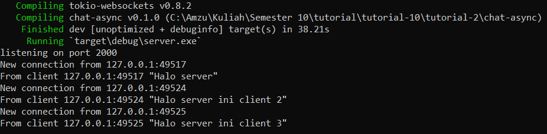
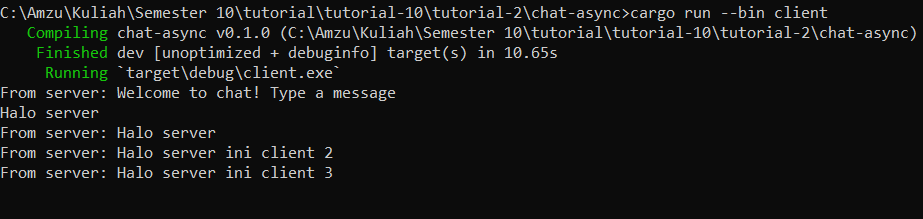
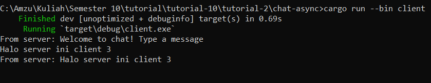

# Tutorial 10
Tutorial 1: Broadcast Chat

The original code can be found in: https://google.github.io/comprehensive-rust/concurrency/async-exercises/chat-app.html

## Experiment 2.1: Original code of broadcast chat
### Steps on How to Run the Code
1. Build/Compile the code
```bash
cargo build 
 ```
2. Run the Server
```bash
cargo run --bin server
```
3. Run the Client
```bash
cargo run --bin client
```
4. Type messages in each client's terminal and observe the chat interactions.

### Explanation
* The `server.rs` file implements a WebSocket server that listens for connections on port 2000. It handles incoming connections and broadcasts messages from one client to all other connected clients.
* The `client.rs` file implements a WebSocket client that connects to the server running on `127.0.0.1:2000`. It allows users to send messages to the server and receive messages from other clients.
* When I run one server and three clients as instructed on the tutorial, each client will establish a connection to the server. There I can type messages in each client's terminal, and the messages will be sent to the server and broadcasted to all other clients. As I observed, the messages appears in the other clients' terminals in real-time.

### Screenshots
1. Server

2. Client 1

3. Client 2

4. Client 3


## Experiment 2.2: Modifying the websocket port
To modify the port to be 8080 we need to change the port number where the server binds and where the client connects to. Here's what we need to do:

### Server Side
In the `server.rs` file, find the line where the `TcpListener` is bound to the address. Change the port number from 2000 to 8080.
```bash
let listener = TcpListener::bind("127.0.0.1:8080").await?;;
```

### Client Side
In the `client.rs` file, find the line where the `ClientBuilder` is configured to connect to the server. Change the port number from 2000 to 8080.
```bash
let (mut ws_stream, _) = 
    ClientBuilder::from_uri(Uri::from_static("ws://127.0.0.1:8080"))
        .connect()
        .await?;
```

### Explanation
When modifying the port to be 8080, it is essential to make the change on both the server side and the client side to ensure they connect to each other correctly. The WebSocket protocol itself does not specify a default port. However, in this code, the port number is explicitly defined in both the server and client files. The WebSocket protocol is implicitly used when connecting to the server because the client uses the `tokio_websockets` crate, which provides WebSocket functionality. These modifications ensure that both the server and client communicate over port 8080, allowing them to establish a connection and interact with each other properly.
